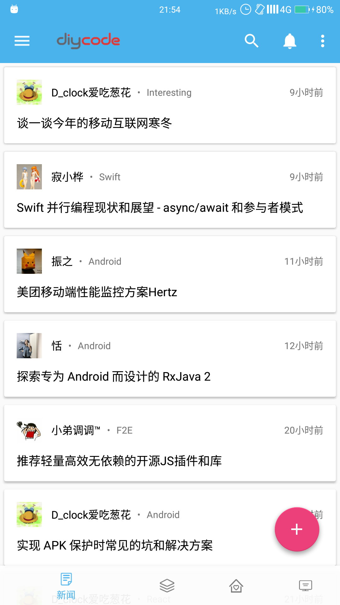
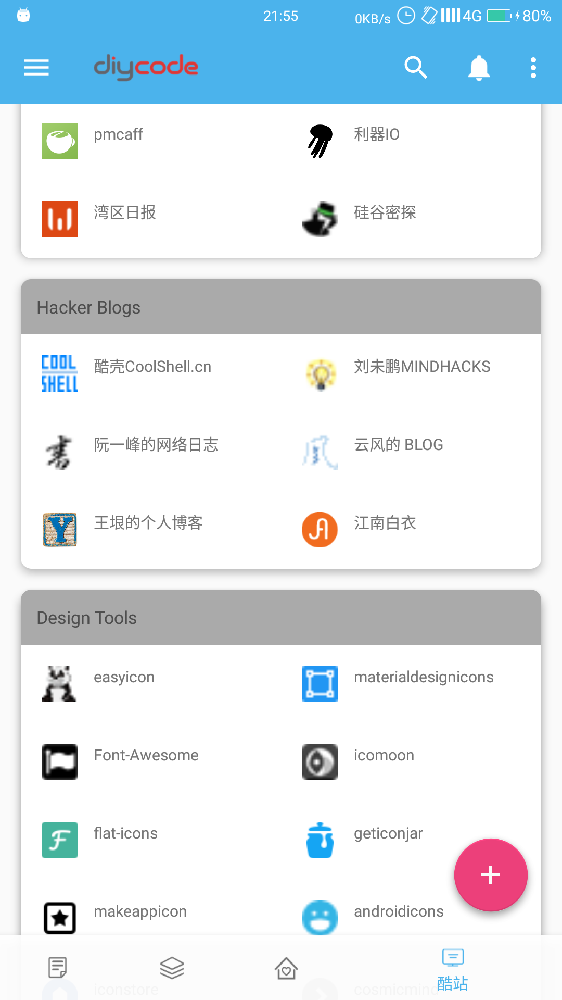
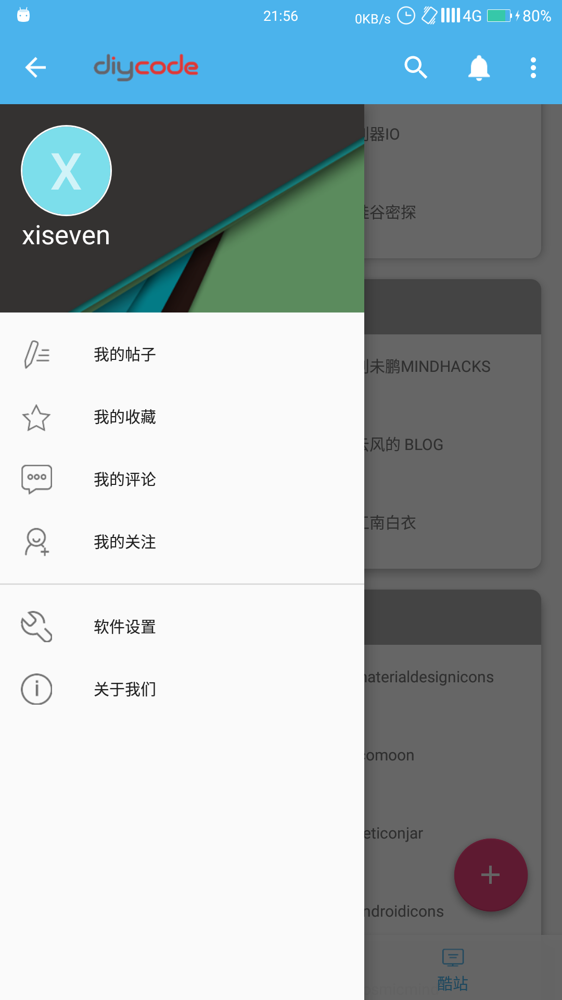
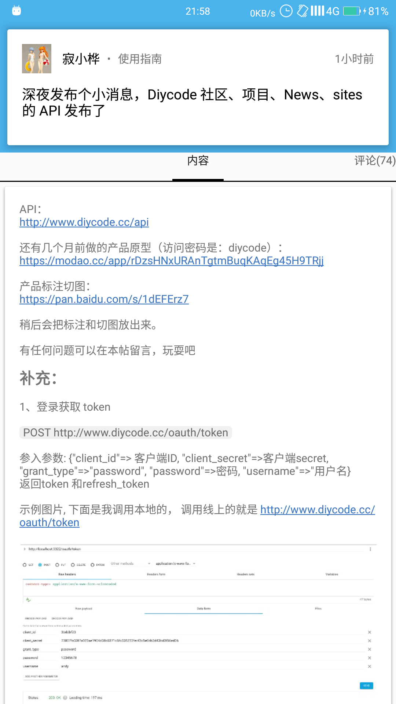

# DiyCode
## 简记
学安卓也有大半年了，之前也做过一些小应用，但一直希望能一个完整的项目，
结合课程作业的原因，找到一个比较合适的项目，看到DiyCode社区发布了API，
于是有了做这个客户端的想法。

[深夜发布个小消息，Diycode 社区、项目、News、sites 的 API 发布了 - DiyCode](https://www.diycode.cc/topics/411)

## 介绍
软件用MVP架构布局，网络请求采用目前十分火热的Retrofit+OkHttp+RxJava
个人比较懒，而且还在学习阶段，写得有点乱，框架方面只是简单能用，连会用都达不到，
经过这次练习，很庆幸发现自己很多问题，还要继续

## 截图

## 更新记录

*2016/12/20*
* 打包第一版（个人定义为beta版）
* 实现基本的浏览功能(news,project,topic,sites)
* 支持社区话题(topic)回复
* 查看登录者所有评论
* 查看登录者消息，只支持手动刷新，不支持后台推送
